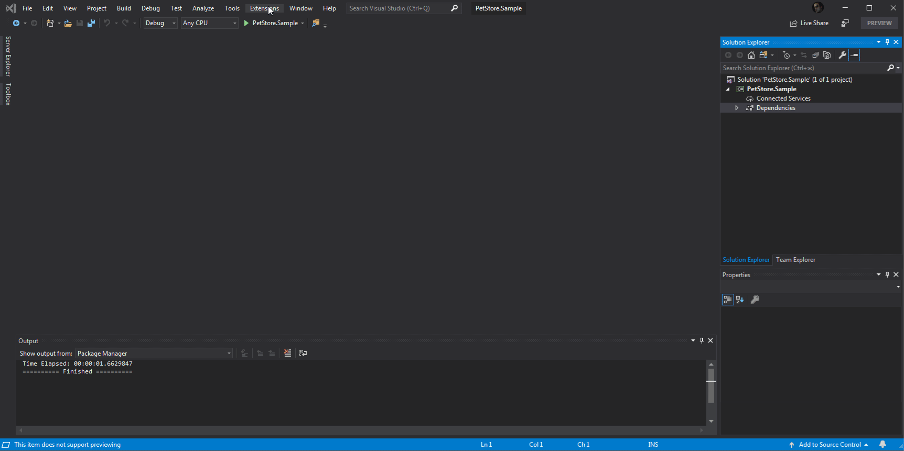
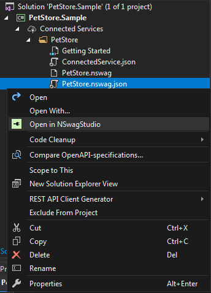
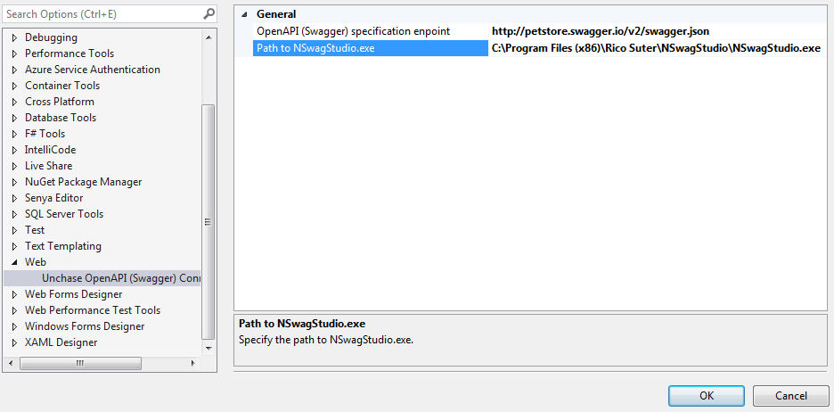
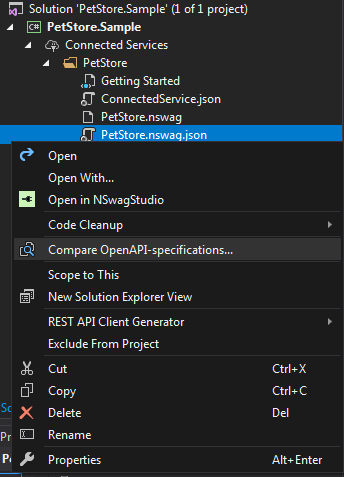
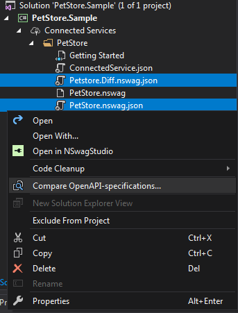
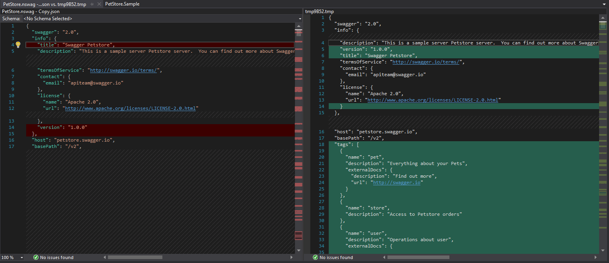
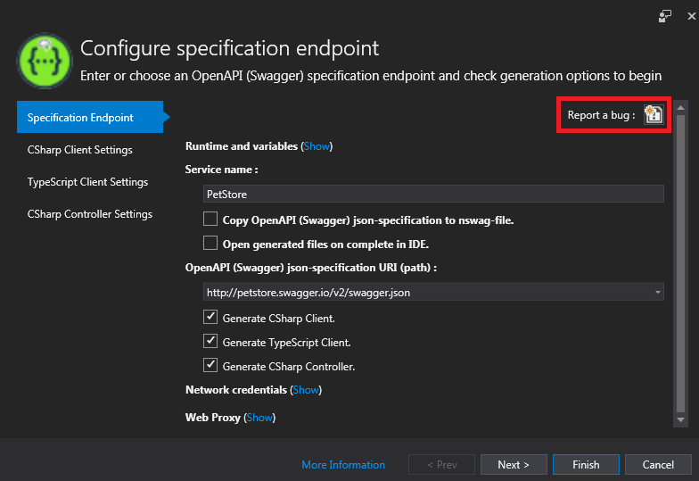

#

[Unchase OpenAPI (Swagger) Connected Service](https://marketplace.visualstudio.com/items?itemName=Unchase.unchaseOpenAPIConnectedService) is a Visual Studio 2017/2019 extension to generate `C#` (`TypeScript`) `HttpClient` (or `C#` `Controllers`) code for `OpenAPI` (formerly [`Swagger API`](https://swagger.io/docs/specification/about/)) web service with [NSwag](https://github.com/RSuter/NSwag).

> Starting from Visual Studio Community 2019 v16.1.3 extensions based on `Microsoft Connected Services` now work fine.

> The project is developed and maintained by [Nikolay Chebotov (**Unchase**)](https://github.com/unchase).

## Getting Started

#### **[Read How-To on medium.com](https://medium.com/@unchase/how-to-generate-c-or-typescript-client-code-for-openapi-swagger-specification-d882d59e3b77)**

Install from `Tools -> Extensions and Updates` menu inside [Visual Studio](https://visualstudio.microsoft.com/vs/) 2017 (for [VisualStudio](https://visualstudio.microsoft.com/vs/) 2019: `Extensions -> Manage Extensions`) or [download](http://vsixgallery.com/extensions/Unchase.OpenAPI.ConnectedService.63199638-6211-4285-ba8f-75b1f0326c2a/extension.vsix)  as `VSIX` package from VSGallery or [download](https://marketplace.visualstudio.com/items?itemName=unchase.unchaseOpenAPIConnectedService)  as `VSIX` package from [Visual Studio Marketplace](https://marketplace.visualstudio.com/items?itemName=Unchase.unchaseopenapiconnectedservice):

## Builds status

|Status|Value|
|:----|:---:|
|Build|
|Buid History|
|GitHub Release|
|GitHub Release Date|
|GitHub Release Downloads|
|VS Marketplace|
|VS Marketplace Downloads|
|VS Marketplace Installs|

## Features

- Generate `C#` or `TypeScript` clients/proxies (client code) from Swagger 2.0 and OpenAPI 3.0 specifications or C# ASP.NET (Core) controllers
- Generate `C#` Controller from Swagger 2.0 and OpenAPI 3.0 specifications
- Generate `.nswag` file for using in [`NSwagStudio`](https://github.com/NSwag/NSwag/wiki/NSwagStudio) (no need to install for generating)
- Add required dependencies for the `C#` client (before generating):
	- Library targeting .NET Standard 1.4+:
		1. Newtonsoft.Json ([NuGet](https://www.nuget.org/packages/Newtonsoft.Json))
		2. System.Net.Http ([NuGet](https://www.nuget.org/packages/System.Net.Http))
		3. System.ComponentModel.Annotations ([NuGet](https://www.nuget.org/packages/System.ComponentModel.Annotations))
	- Library targeting the full .NET:
		1. Newtonsoft.Json ([NuGet](https://www.nuget.org/packages/Newtonsoft.Json))
		2. System.Runtime.Serialization (GAC)
		3. System.ComponentModel.DataAnnotations (GAC)
	- Library targeting PCL 259 (Portable Class Library):
		1. Newtonsoft.Json ([NuGet](https://www.nuget.org/packages/Newtonsoft.Json))
		2. Microsoft.Net.Http ([NuGet](https://www.nuget.org/packages/Microsoft.Net.Http))
		3. Portable.DataAnnotations ([NuGet](https://www.nuget.org/packages/Portable.DataAnnotations))
- Add Required dependences for the `C#` controller (before generating):
	1. Microsoft.AspNetCore.Mvc ([NuGet](https://www.nuget.org/packages/Microsoft.AspNetCore.MVC))
- **Command** to open generated `.nswag` and `.nswag.json` files in [NSWagStudio](https://github.com/NSwag/NSwag/wiki/NSwagStudio)
- **Command** to compare `.nswag.json` specification file with another `.nswag.json` specification file (or specification given by `endpoint`)
- Storage of the last 10 endpoints (specification path)

## Settings Meaning

Meaning of the Unchase [OpenAPI (Swagger) Connected Service](https://marketplace.visualstudio.com/items?itemName=unchase.unchaseOpenAPIConnectedService) settings according to [NSwagStudio](https://github.com/NSwag/NSwag/wiki/NSwagStudio):

## Custom Commands

### `Open in NSwagStudio` Command

Since *v1.1.** have been added menu command embedded in Visual Studio Solution Explorer context menu lets you open generated `.nswag` and `.nswag.json` files in [NSwagStudio](https://github.com/NSwag/NSwag/wiki/NSwagStudio).

This extension is for those times where you generate `.nswag` and `.nswag.json` files and you want to be able to quickly open it in [NSwagStudio](https://github.com/NSwag/NSwag/wiki/NSwagStudio).

#### Prerequisite

> In order to use this extension, you must have [Visual Studio](https://visualstudio.microsoft.com/vs/) 2017/2019, this connected service as well as [NSwagStudio](https://github.com/NSwag/NSwag/wiki/NSwagStudio) installed.

#### Solution Explorer

You can open `.nswag` and `.nswag.json` files in [NSWagStudio](https://github.com/NSwag/NSwag/wiki/NSwagStudio) by simply right-clicking it in Solution Explorer and select **Open in NSwagStudio**:

#### Path to NSwagStudio.exe

If you installed [NSwagStudio](https://github.com/NSwag/NSwag/wiki/NSwagStudio) at a non-default location, a prompt will ask for the path to `NSwagStudio.exe`.

You can always change the location in *Tools -> Options -> Web -> Unchase OpenAPI (Swagger) Connected Service*:

### `Compare OpenAPI-specifications...` Command

Since *v1.2.** have been added menu command embedded in Visual Studio Solution Explorer context menu lets you compare generated `.nswag.json` specification-file with another `.nswag.json` specification-file (or with specification given by `endpoint`).

This extension is for those times where you generate `.nswag.json` file and you want to quickly compare it with another specification or specification given by `endpoint`.

#### Prerequisite

> In order to use this extension, you must have [Visual Studio](https://visualstudio.microsoft.com/vs/) 2017/2019 as well as this connected service.

#### Solution Explorer

You can compare `.nswag.json` specification-file with another `.nswag.json` specification-file (or with specification given by `endpoint`) by simply selecting one or two files and right-clicking them in Solution Explorer and select **Compare OpenAPI-specifications...**:

 

#### Path to the specification `Endpoint`

You can always change the specification Endpoint to compare with in *Tools -> Options -> Web -> Unchase OpenAPI (Swagger) Connected Service*:

#### Compare View

## HowTos

- [ ] Add HowTos in a future
- [ ] ... [request for HowTo you need](https://github.com/unchase/Unchase.OpenAPI.Connectedservice/issues/new?title=DOC)

## Troubleshooting

### Can't open .nswag file in NSwagStudio

- You can use **Open in NSwagStudio** menu command
- If generated code corrupted, try to open `.nswag` file in [`NSwagStudio`](https://github.com/RSuter/NSwag/wiki/NSwagStudio) (Windows GUI for editing .*nswag files)
- If it doesn't open, try to create new `.nswag` file in [`NSwagStudio`](https://github.com/RSuter/NSwag/wiki/NSwagStudio) for the same API service link and check the differences

### Installation completes but I can't see the Service in the list of connected services (Visual Studio 2019)

- Relevant [bug report](https://developercommunity.visualstudio.com/content/problem/468751/vs2019-preview-cannot-install-connected-service-ex.html). `Connected Services` restored in the v16.1.3 update to [Visual Studio](https://visualstudio.microsoft.com/vs/) 2019.

## Roadmap

See the [changelog](CHANGELOG.md) for the further development plans and version history.

## Feedback

Please feel free to add your [review](https://marketplace.visualstudio.com/items?itemName=unchase.unchaseOpenAPIConnectedService&ssr=false#review-details), [request a feature](https://github.com/unchase/Unchase.OpenAPI.Connectedservice/issues/new?title=FEATURE), [ask a question](https://marketplace.visualstudio.com/items?itemName=unchase.unchaseOpenAPIConnectedService&ssr=false#qna) or [report a bug](https://github.com/unchase/Unchase.OpenAPI.Connectedservice/issues/new?title=BUG) including in connected service: 

Thank you in advance!

## Thank me!

If you like what I am doing and you would like to thank me, please consider:

Thank you for your support!

----------

Copyright &copy; 2019 [Nikolay Chebotov (**Unchase**)](https://github.com/unchase) - Provided under the [Apache License 2.0](LICENSE.md).

